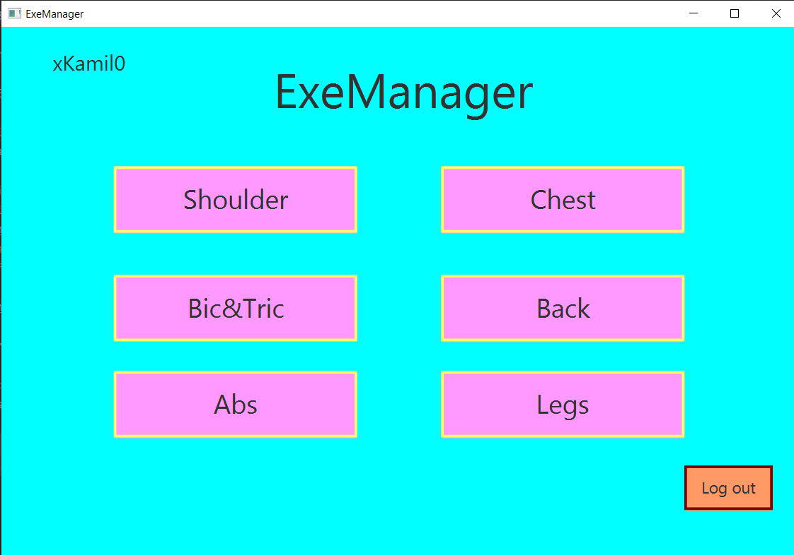
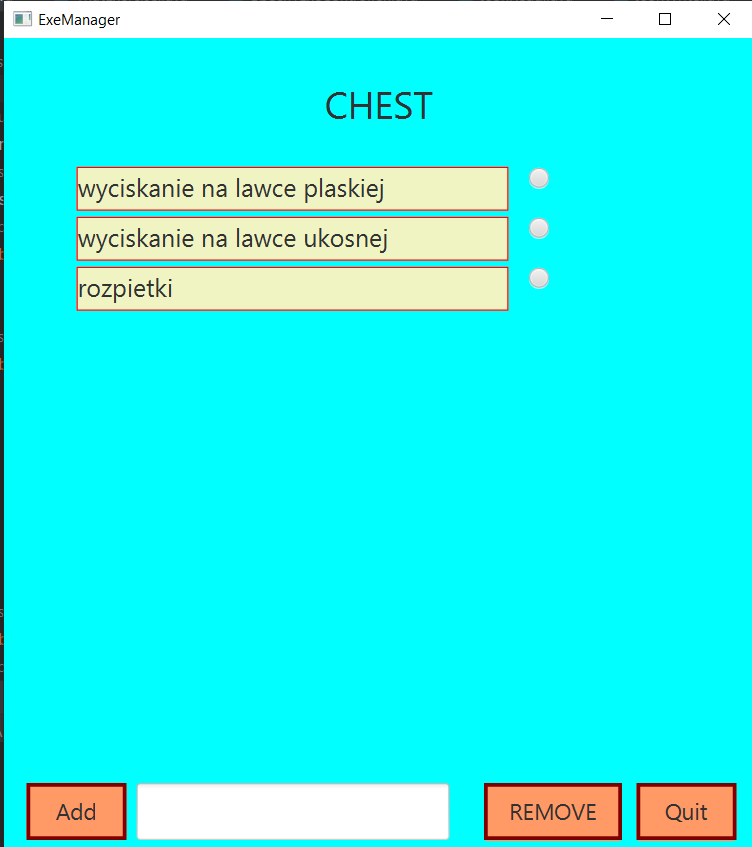
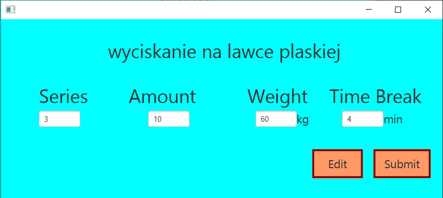

# ExeManager
An application allows to manage your training
# Using 
Firstly you have to login in (or register if you don't have an account)
Then main menu will appear. It is splited into every body part. 

After clicking one of body part you will be moved to: 

Here you can add, remove exercises. After clicking one of the exercise(that you've created or you've added earlier) you will be
moved to specified exercises manager.
You are able to manage statistic of specified exercise.

